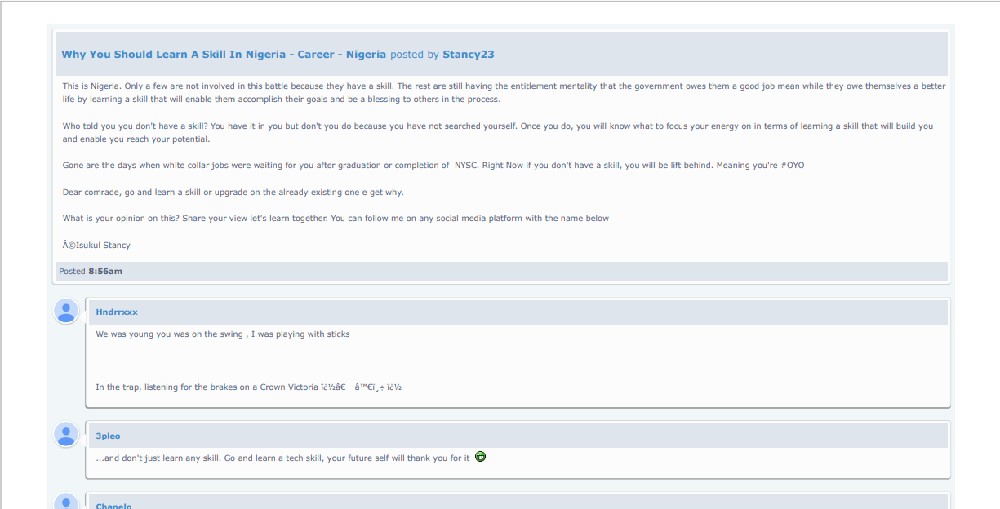

## Nairaland View with Golang

**The *Golang* application `source.go` takes in a Nairaland thread link and generates a pdf document `new-nairaland-page.pdf` showing the posts on the thread, with their metadata such as the comments, names of commenters, date of creation of thread etc.**

The application accepts its input (thread link) through the command line. A default link has been provided, which can be used by just pressing *Enter* in the prompt.

Successive outputs are printed to show the stages of the program that were run successfully.

Intermediate html files were also generated. They are only used by the program, but they can still be inspected. They are:

`webpage.html`: existing web page of the Nairaland thread

`new-nairaland-page.html`: new version of the web page

The *Golang* source code and the intermediate and final output files all lie in the current working directory.

To run the application, use the following code outline:

	CD "directory where the souce code is"
	go run source.go

Note that the *main* program imports the following libraries, which all have to be installed for it to run (*Golang* itself should have been installed too, obviously):

- `fmt`, `io/ioutil`, `net/http`, `log`, `golang.org/x/net/html`, `strings`, `bytes`, `io`, `text/template`, `github.com/ConvertAPI/convertapi-go`, `github.com/ConvertAPI/convertapi-go/config`, `github.com/ConvertAPI/convertapi-go/param`

More features will be added in the future.

Take a look at the gallery below ;)

---

---

